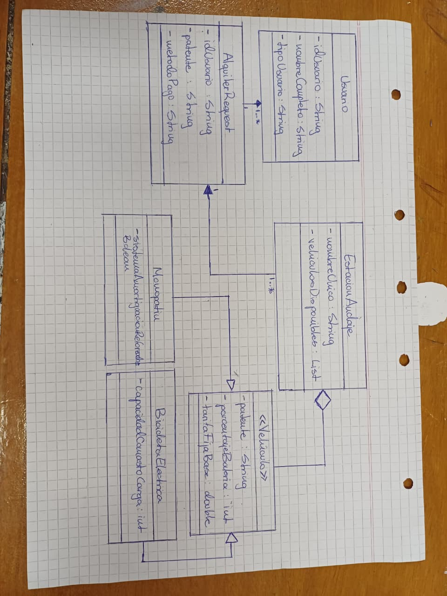

-------------------
# GRUPO: CTRLV
-------------------
## ALUMNOS:
### FRANCISCO ANTONIO GONZALEZ 
### VIRGINIA DEL VALLE VERA HERRERA
### ISMAEL ALEJANDRO FLORES
### VALENTINO LEMOR

  

--------------------------------------------------------------------------------
CASO DE PRUEBA 1: Flujo Exitoso (Usuario REGULAR + Monopatín con batería óptima)
--------------------------------------------------------------------------------
* Validar que el sistema localiza el vehículo, calcula la tarifa base 
  sin descuento y procesa el pago simulado de forma correcta.

  - "idUsuario": "USR01",
  - "patente": "AAA111",
  - "metodoPago": "TARJETA"

* Verificar la sección 'Responses':
  - Code (Código HTTP): 200 OK
  - Response body (Cuerpo): 
    "Desbloqueo Exitoso. Vehículo Patente: AAA111 | Monto cobrado: $500.0"

--------------------------------------------------------------------------------
CASO DE PRUEBA 2: Alerta de Batería Insuficiente (Bicicleta < 15% de carga)
--------------------------------------------------------------------------------

* Verificar que se interrumpe la operación inmediatamente si el rodado 
  no cumple con el nivel mínimo apto para circular.
* Reemplazar el contenido del 'Request body' por los siguientes DATOS:

  - "idUsuario": "USR01",
  - "patente": "BBB222",
  - "metodoPago": "BILLETERA"

* Verificar la sección 'Responses':
  - Code (Código HTTP): 400 Bad Request
  - Response body (Cuerpo): 
    "Alarma del Sistema: Batería Insuficiente. Operación bloqueada."

--------------------------------------------------------------------------------
CASO DE PRUEBA 3: Aplicación de Beneficio Premium (Usuario PREMIUM)
--------------------------------------------------------------------------------
* Validar que el motor de cálculo matemático aplique de manera estricta 
  el descuento del 15% sobre el precio del vehículo.
* Reemplazar el contenido del 'Request body' con los siguientes DATOS:

  - "idUsuario": "USR02",
  - "patente": "AAA111",
  - "metodoPago": "TARJETA"

* Verificar la sección 'Responses':
  - Code (Código HTTP): 200 OK
  - Response body (Cuerpo): 
    "Desbloqueo Exitoso. Vehículo Patente: AAA111 | Monto cobrado: $425.0"
    (Cálculo matemático puro: $500.0 * 0.85 = $425.0)

--------------------------------------------------------------------------------
CASO DE PRUEBA 4: Alerta de Vehículo No Encontrado (Patente Inexistente)
--------------------------------------------------------------------------------

* Validar que el bucle secuencial iterativo recorra todas las estaciones 
  y dispare el mensaje preventivo al no hallar coincidencia exacta.
* Reemplazar el contenido del 'Request body' por los siguientes DATOS:

  - "idUsuario": "USR01",
  - "patente": "XYZ999",
  - "metodoPago": "TARJETA"

* Presionar el botón: [Execute].
* Verificar la sección 'Responses':
  - Code (Código HTTP): 400 Bad Request
  - Response body (Cuerpo): 
    "Alarma del Sistema: Vehículo No Encontrado."
================================================================================

--------------------------------------------------------------------------------
PAQUETE DE SERVICIO (LOGICA OPERATIVA Y MOCK DE DATOS EN MEMORIA)
--------------------------------------------------------------------------------

* AlquilerService (Estado y Algoritmos):
  - Estado en Memoria: Declara dos colecciones privadas 'List<EstacionAnclaje>' y 
    'List<Usuario>' que actúan como la persistencia transitoria de la aplicación.
  - Constructor (Mock): Inicializa datos por defecto (usuarios regular/premium, 
    monopatín con batería óptima y bicicleta con batería baja cargados en una 
    estación central) para habilitar las pruebas inmediatas desde la consola web.

* DesacopladorPagosFactory, ProcesadorPago y Estrategias:

  La interfaz 'ProcesadorPago' fuerza la firma del método 'procesar(double monto)'. 
  Las clases 'PagoTarjeta' y 'PagoBilletera' implementan dicho comportamiento 
  emulando el éxito de la transacción mediante salidas por la consola estándar. 
  La factoría abstrae la lógica de instanciación del servicio web a través de un 
  método estático basado en condicionales simples.

* AlquilerController:
  Clase configurada bajo la anotación @RestController con el prefijo base de 
  ruta '/api/alquileres'. 
  - Inyección: Declara un atributo privado de tipo 'AlquilerService' acoplado de 
    forma automática por el framework mediante @Autowired.
  - Endpoint HTTP: Expone un método GET en la sub-ruta '/desbloquear' parametrizado 
    con la anotación @RequestParam. Esto fuerza a que los datos de entrada del 
    'AlquilerRequest' viajen embebidos dentro del cuerpo de la petición en formato JSON.
